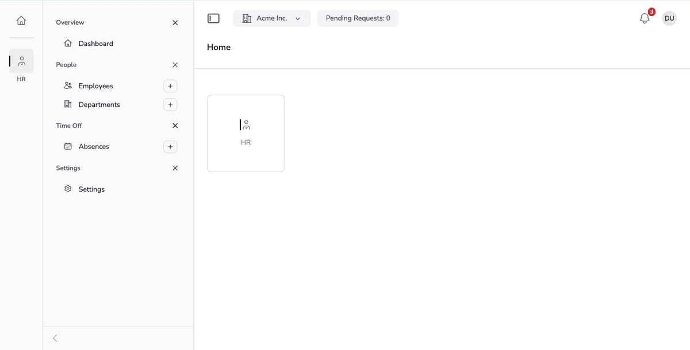

# noerd/notifications

[](https://packagist.org/packages/noerd/notifications)
[](LICENSE)

An **extension package for [`noerd/noerd`](https://github.com/noerd-dev/noerd)**, the
YAML-driven Livewire framework for multi-tenant Laravel applications. It plugs into the noerd
top bar and the noerd user and tenant model — it is not a standalone Laravel package and does
nothing without a noerd installation.

What it adds: in-app notifications for every app built on noerd — a bell in the top bar with a
red badge for unread entries, a dropdown with the latest notifications, "Mark all as read", and a
click that opens the notification's target. Every module of an application sends through one
API — a service call, or a regular Laravel notification channel.



## Features

- **Bell in the top bar** — registers itself on install, right of the quick menu; unread badge,
  the latest 20 entries, level colours (info, success, warning, error), relative timestamps in
  the reader's locale
- **One API for every sender** — `NotificationService::send()` with an explicit user and tenant,
  so queued jobs and scheduled commands can notify without a signed-in user
- **A Laravel notification channel** — return `NoerdChannel::class` from `via()` and a
  `NoerdMessage` from `toNoerd()`; the same notification class may also send a mail
- **Targets without coupling** — a notification points at a record (a route, with a component
  fallback) or at a page URL; the module never knows which module owns the target
- **Per user, per tenant** — a user only ever sees the notifications of the tenant they are
  working in; foreign notifications answer 404
- **Extensible** — a `NotificationSent` event after every write, a model factory for your tests,
  German translations, a prune command for old entries
- **No infrastructure** — the bell polls every 30 seconds; no WebSockets, no broadcasting setup

## Requirements

- A Laravel 12 or 13 application on PHP 8.3+ that runs the noerd framework:
  [`noerd/noerd`](https://github.com/noerd-dev/noerd) 0.16+ installed and set up
  (`composer require noerd/noerd && php artisan noerd:install`). The package renders into
  noerd's top bar, authenticates against noerd's user guard and stores notifications per noerd
  tenant — there is nothing to hook into in a plain Laravel app

## Installation

```bash
composer require noerd/notifications
php artisan noerd:install-notifications
```

The install command runs the migration (one table, `noerd_notifications`). It registers no
tenant app and publishes no configuration — the bell appears in the top bar of every app as
soon as the package is installed.

## Sending a notification

### Through the service

```php
use NoerdNotifications\Services\NotificationService;
use NoerdNotifications\Support\NotificationTarget;

app(NotificationService::class)->send(
    userId: $report->requested_by_user_id,
    tenantId: $report->tenant_id,
    title: __('Report finished'),
    body: __(':name is ready to download.', ['name' => $report->name]),
    target: new NotificationTarget(
        route: 'reports.report.detail',
        component: 'reports::report-detail',
        arguments: ['modelId' => $report->id],
    ),
    level: 'success',
    icon: 'document-check',
    type: 'reports.finished',
);
```

| Argument | Meaning |
|----------|---------|
| `userId`, `tenantId` | The recipient and the tenant the notification belongs to — always explicit, never taken from the session |
| `title` | Shown in bold; stored already translated (translate with `__()` when sending) |
| `body` | Optional second line |
| `target` | Where a click leads (see below); `null` only marks the entry read |
| `level` | `info` (default), `success`, `warning` or `error` — decides the icon colour |
| `icon` | A [heroicon](https://heroicons.com) name such as `sparkles`; an unknown name falls back to the bell |
| `type` | A free key of the sender (`reports.finished`) for filtering and statistics |

### Through a Laravel notification

`NoerdUser` is `Notifiable`. A notification class that returns the channel from `via()` and a
`NoerdMessage` from `toNoerd()` is stored exactly like a service call — and may send a mail
through the regular channels at the same time:

```php
use Illuminate\Notifications\Notification;
use NoerdNotifications\Channels\NoerdChannel;
use NoerdNotifications\Support\NoerdMessage;
use NoerdNotifications\Support\NotificationTarget;

class ReportFinished extends Notification
{
    public function __construct(private readonly Report $report) {}

    public function via(object $notifiable): array
    {
        return [NoerdChannel::class, 'mail'];
    }

    public function toNoerd(object $notifiable): NoerdMessage
    {
        return new NoerdMessage(
            title: __('Report finished'),
            body: __(':name is ready to download.', ['name' => $this->report->name]),
            target: new NotificationTarget(url: route('reports.index')),
            level: 'success',
            tenantId: $this->report->tenant_id,
        );
    }
}

$user->notify(new ReportFinished($report));
```

Without a `tenantId` on the message the notifiable's currently selected tenant is used; a user
without a tenant receives nothing (there is no bell to show it in).

### Targets

A `NotificationTarget` has three shapes:

| Shape | Behaviour on click |
|-------|--------------------|
| `route` + `arguments` | Opens the record as a modal through the named `Route::livewire()` route; the browser URL is rewritten to the record, so the notification stays shareable |
| `component` + `arguments` | Fallback when the route is not registered (the owning module is not installed): opens the component as a modal |
| `url` | Navigates to the page |

Pass `route` AND `component` for a record — the route wins when it exists, the component
keeps the click working otherwise. This is the `Noerd::modalFor()` contract of the framework.

## Reacting to notifications

`NoerdNotifications\Events\NotificationSent` fires after every stored notification, with the
`Notification` model as `$event->notification`. Listen to it to add a channel the module does
not ship — a push message, a broadcast, a Slack post:

```php
Event::listen(NotificationSent::class, function (NotificationSent $event): void {
    // $event->notification->user, ->title, ->notificationTarget(), ...
});
```

## Housekeeping

Read notifications are kept until you prune them; unread ones stay until the user saw them.
Schedule the command in your `routes/console.php`:

```php
Schedule::command('notifications:prune --days=90')->daily();
```

## Updating

```bash
composer update noerd/notifications
php artisan noerd:update-notifications   # or: php artisan noerd:update-all
php artisan migrate
```

The update command publishes nothing (the package ships no YAML and no config); it exists so
`noerd:update-all` covers the module.

## Testing your own code

The model ships a factory:

```php
use NoerdNotifications\Models\Notification;

Notification::factory()->for($user, 'user')->create(['tenant_id' => $tenantId]);
Notification::factory()->read()->level('warning')->create([...]);
```

Assert a sent notification with `Notification::withoutGlobalScopes()->where('user_id', ...)`, or
fake the `NotificationSent` event with `Event::fake()`.

## Development

See [`AGENTS.md`](AGENTS.md) for contributor notes. Tests (Pest):

```bash
# standalone, as CI runs it
composer install
vendor/bin/pest

# inside a host project that mounts the module under app-modules/noerd-notifications
php artisan test --compact app-modules/noerd-notifications/tests
```

Format with `vendor/bin/pint` (from a host: `vendor/bin/pint --config app-modules/noerd-notifications/pint.json app-modules/noerd-notifications`).

## License

MIT — see [`LICENSE`](LICENSE).
